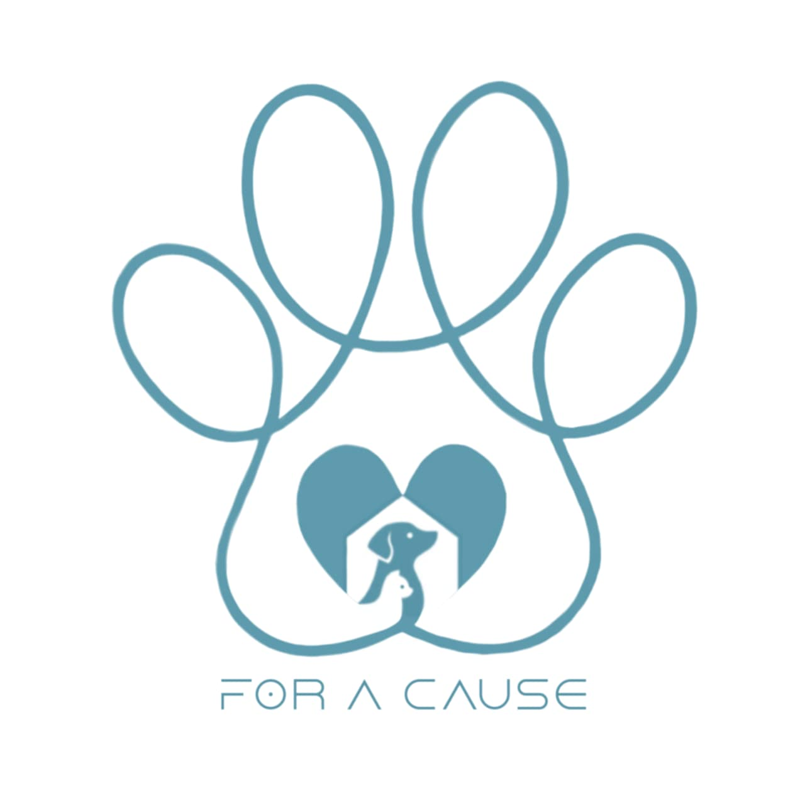

<p align="center">
  
</p>

<h1 align="center">Paws for a Cause</h1>

<p align="center">
    <em><code>🐾 A Community-Driven Initiative to Support Stray Animals through Donations 🐾</code></em>
</p>

<p align="center">
    <a href="https://github.com/trishncl">Trisha Nicole L. Sañosa</a><br>
    IT-2104
</p>

---

<details>
  <summary><strong>Table of Contents<strong></summary>
  
  - [Project Overview](#project-overview)
  - [Problem Statement: Chosen SDG](#problem-statement-chosen-sdg)
  - [OOP Principles](#oop-principles)
  - [SQL Functions in Queries](#sql-functions-in-queries)
  - [Features](#features)
    - [Admin Features](#admin-features)
    - [Donor Features](#donor-features)
  - [Getting Started](#getting-started)
    - [Installation](#installation)
    - [Running the Program](#running-the-program)

</details>

---

##  Project Overview

**Paws for a Cause** is a console-based application aimed at supporting stray animals through donations and fostering collaboration with animal welfare organizations. The platform simplifies the process of collecting and managing donations while aligning with goals of promoting compassion for animals and inspiring collective action.

This platform connects donors with organizations, enabling profile creation, donation management, and history tracking. Admin can oversee and manage user profiles and donation records effectively.

---

## Problem Statement: Chosen SDG

Stray animals often lack access to food, shelter, and medical care due to limited funding or resources. While there are many who wish to help, there is no central platform to connect donors with organizations or track how their contributions are used effectively. **Paws for a Cause** addresses this issue by aligning with the following Sustainable Development Goals (SDGs):  

<p>
    
  <br>
  <em>SDG 3: Supporting the health and well-being of stray animals.</em>
</p>

<p>
    
  <br>
  <em>SDG 15: Protecting life on land through improved care for stray animals.</em>
</p>

---

## OOP Principles
The project incorporates Object-Oriented Programming (OOP) principles to ensure modularity, reusability, and clear structure.

1. **Encapsulation**  
   - Hides internal data and provides controlled access through getters and setters (e.g., `User` class and `UserValidator` methods).  

2. **Inheritance**  
   - Promotes code reuse; `Donor` inherits from `User` to access its properties and methods.  

3. **Polymorphism**  
   - Allows different classes to define unique implementations of a method (e.g., `DonationType` with abstract `confirmAndProcessDonation` method).  

4. **Abstraction**  
   - Hides unnecessary details; `User` class provides abstracted methods like `getName()` and `verifyPin()` for interacting with user data.  

---

## SQL Functions in Queries

The system uses SQL functions in the following ways:
- **SELECT**: Retrieve donation history, donor details, and a list of registered donors.  
- **UPDATE**: Modify donation status (e.g., pending, completed) or update donor profiles.  
- **DELETE**: Remove donations marked as "Cancelled."  
- **Aggregate Functions**: Count donors and donations by category and compute total monetary donations. 

---

## Features

### Admin Features
- **User Authentication**: Admin login.  
- **Donation History**: Displays all recorded donations.  
- **Donation Status**: Update the status of donations (pending, completed, or cancelled).  
- **Delete Donation**: Remove cancelled donations.  
- **Donors Profile**: Access donor details.  
- **Animal Welfare Organizations**: View all listed organizations.  
- **Count Different Categories**: Track donation categories and donor counts.  
- **Sum of Donation Amount**: Compute total monetary donations received.  

### Donor Features
- **User Authentication**: Login or signup for donors.  
- **Donation Management**: Manage in-kind and monetary donations.  
- **History**: View personal donation history.  
- **Profile**: Update donor details.  
- **Organization**: Display all available organizations for donations.  

---

## Getting Started

### Installation

1. Download and install **XAMPP**: [https://www.apachefriends.org](https://www.apachefriends.org).  
2. Install the JDBC driver for SQL: [https://dev.mysql.com/downloads/connector/j/](https://dev.mysql.com/downloads/connector/j/).  
3. Download and install **VSCode**: [https://code.visualstudio.com/](https://code.visualstudio.com/).  
4. Install essential extensions:  
   - **Java Extension Pack**  
   - **SQLTools**  
5. Add the JDBC driver JAR file to the referenced libraries in your project.

#### Running the Program

1. Start **XAMPP** and ensure both **Apache** and **MySQL** are running.  
  ⚠ **Note:** These services must be active while running the program.
2. Connect VSCode to SQL using the SQLTools extension:
  ```java
  url: "jdbc:mysql://localhost:3306/your_database_name"
  username: "root"
  password: "your_password" // Leave empty if not set
  ```
3. Verify that the database is set up and properly connected.
4. Open 'Main.java' in VSCode, and compile the project using the 'javac' command or the Run button.
5. Use the program interface to log in as either a **Donor** or **Admin** and access the system's features.
